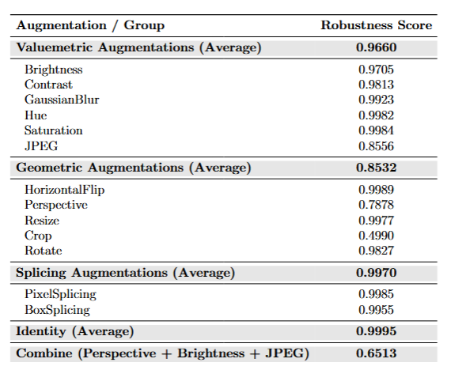
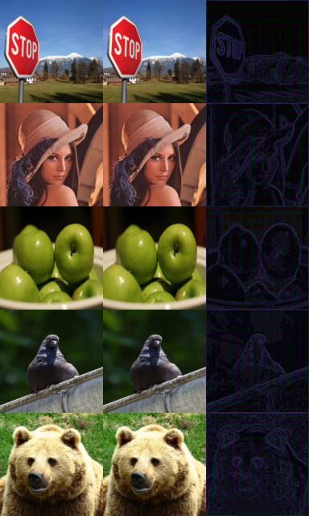
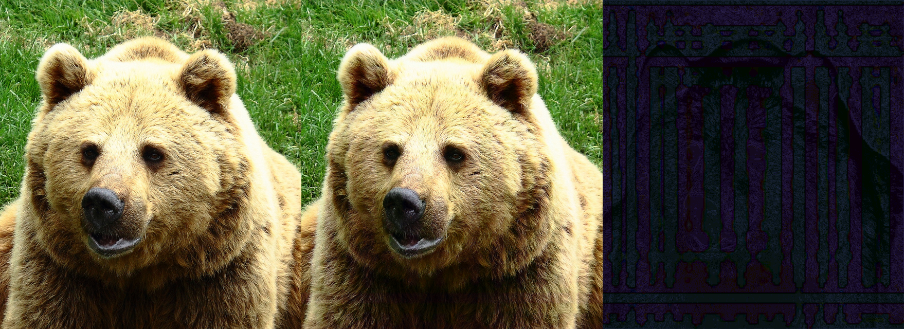
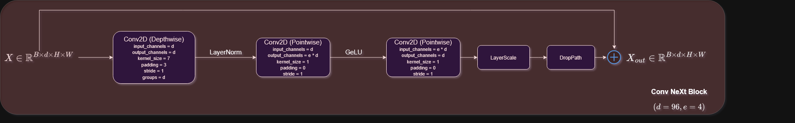

## Introduction
Image watermarking model, combining ideas from HiDDeN (https://arxiv.org/pdf/1807.09937) and more recent models, like VideoSeal (https://arxiv.org/pdf/2412.09492) and WAM (https://arxiv.org/abs/2411.07231). First checkpoint operates on 128x128 with a capacity of 32. It can support variable resolutions for input, but the recommended approach is to always operate on 128x128 - if the input image is larger that 128x128, one approach is to apply the watermarking model in disjoint blocks of 128x128 of the input. It achieves comparable results to previous models, with only $29M$ parameters, though more thorough evaluation is needed to confirm this, since only a portion of MS COCO was used for training and evaluation.

Achieved imperceptibility is $\sim 41.4 dB$. Examples of images watermarked by the model in 128x128:

As mentioned above, the watermark might be vissible if embedding in higher resolutions, which is why the recommended approach is patch watermarking. An example of such a case:

## Usage
After cloning and installing requirements, download the checkpoint from the following [link](https://drive.google.com/file/d/1AoXfibaENSebCEYdAmwOwPvHoLsPf2gk/view?usp=drive_link) to this directory. You can see usage examples in [example.py](example.py).

## Architecture details
For the embedder we use a ConvNeXt based UNet, while for the extractor we use ConvNeXt-Tiny.

Augmentations used during training:

For JPEG we use a custom differentiable implementation based on (https://machine-learning-and-security.github.io/papers/mlsec17_paper_54.pdf), and JND - Just Noticeable Difference watermark attenuation. Corresponding PyTorch modules can be found [here](augmentations/valuemetric.py) and [here](modules.py).